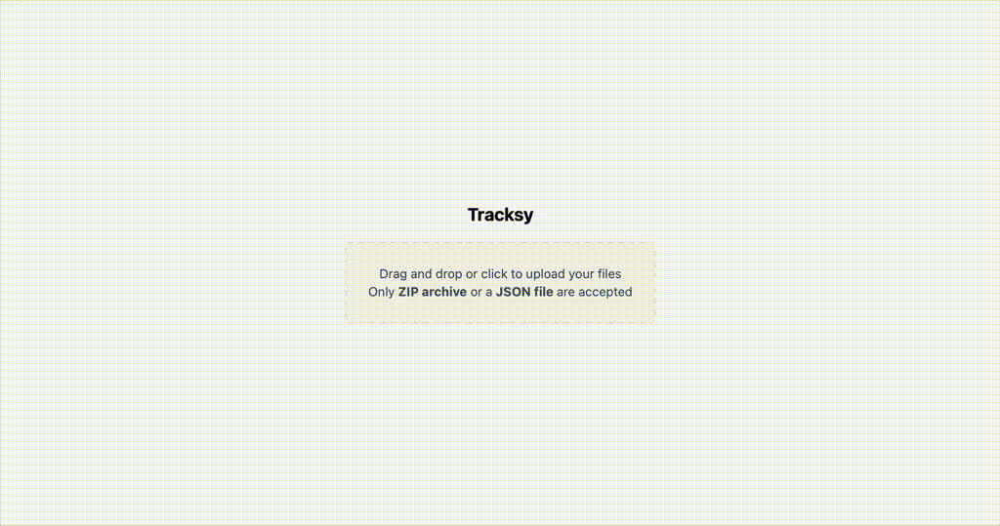

# Tracksy

👀 Visualize and understand how you listen to music.
- > The same old song? Late at night? Only in summer?
- Tracksy aims to help you answer these questions. It helps you see your data without us seeing your data.

🦆 Powered by DuckDB WASM and Astro React.

🚧 Currently only works with Spotify streaming data.

## Project Structure

Inside of this project, you'll see the following folders and files:

```text
/
├── app/
└── functions/
```

`app/` is the front end. It's an Astro project using DuckDB for data storage. This means that your uploaded data stays with you, client-side.
We don't want to help you understand your data without knowing your data.
For developers, take a look at [`app/README.md`](app/README.md) for more details on development.

`functions/` is the backend part for enriching your data from the provider's API. Although **the application doesn't yet use this part**, it is present because development is taking place in parallel. This part is being reworked for a more privacy-friendly solution.
For developers, take a look at [`functions/README.md`](functions/README.md) for more details on development.

## Usage

### ⬇️ Download your data

You can use pre-generated datasets avaible at [tracksy/synthetic-datasets](https://huggingface.co/datasets/tracksy-app/synthetic-datasets):
```shell
# /!\ The size of this file is greater than 16.8Mb.
wget https://huggingface.co/datasets/tracksy/synthetic-datasets/resolve/main/datasets/spotify/one_file_multiple_years.zip?download=true
```
Other files are available, see [tracksy/synthetic-datasets](https://huggingface.co/datasets/tracksy-app/synthetic-datasets) on huggingface.

Or use your own Spotify data:
1. Request your Spotify data on [your Spotify account](https://www.spotify.com/account/privacy/)
   - Select "*Extended streaming history*"
   - Click on "*Request data*"
2. 30 days or less later
3. Open the mail from Spotify and download files

### 🚀 Upload your data

Go to [tracksy] (https://tracksy-app.web.app) and upload your file.

Or run the application locally with:
```shell
cd app
pnpm ci
pnpm dev
```
go to [`http://localhost:4321/`](http://localhost:4321/) and upload your downloaded file.

### 👀 Visualize your data
Once you've uploaded your file, you'll be able to see graphs about your data.



## "Roadmap"
The project is currently under development. We plan to add visualizations as well as a simplified view to make understanding streaming data as accessible as possible.
We also intend to support other data sources (Deezer, Funkwhale, etc.).

## Contributing

Contributions are welcome! Feel free to open an issue or a pull request.
