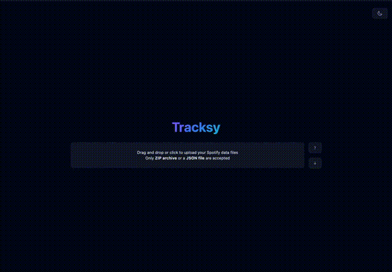

# Tracksy

[](https://github.com/withastro/astro) [](https://github.com/duckdb/duckdb) [](https://huggingface.co/datasets/tracksy/synthetic-datasets) [](https://github.com/astral-sh/uv) [](https://github.com/astral-sh/ruff) [](https://github.com/astral-sh/ty)

[](./LICENSE) [](https://github.com/gudsfile/tracksy/actions/workflows/deploy-app-live.yml) [](https://github.com/gudsfile/tracksy/actions/workdlows/generate-synthetic-datasets.yml)

👀 Visualize and understand how you listen to music.

- > The same old song? Late at night? Only in summer?
- Tracksy aims to help you answer these questions. It helps you see your data without us seeing your data.

🦆 Powered by DuckDB WASM and Astro x React.

🚧 Currently only works with Spotify streaming data.

## Project Structure

Inside of this project, you'll see the following folders and files:

```text
/
├── app/
└── synthetic-datasets/
```

`app/` is the front end. It's an Astro project using DuckDB for data storage. This means that your uploaded data stays with you, client-side.
We don't want to help you understand your data without knowing your data.
For developers or curious, take a look at [`app/README.md`](app/#tracksy-app) for more details on development.

`synthetic-datasets/` is use to generate datasets to test the Tracksy application.
For developers or curious, take a look at [`synthetic-datasets/README.md`](synthetic-datasets/) for more details on development.

## Usage

### ⬇️ Download your data

You can use pre-generated datasets available on Hugging Face [tracksy/synthetic-datasets](https://huggingface.co/datasets/tracksy/synthetic-datasets/tree/main).
For example, download one of the files from the interface or with the following command:

```shell
# /!\ The size of this file is greater than 44Mb, other files are available.
curl -LO https://huggingface.co/datasets/tracksy/synthetic-datasets/resolve/main/datasets/spotify/streamings_500000.zip?download=true
```

Or use your own Spotify data:

1. Request your Spotify data on [your Spotify account](https://www.spotify.com/account/privacy/)
   - Select "_Extended streaming history_"
   - Click on "_Request data_"
   - **Confirm your request** by clicking on Spotify's confirmation e-mail
2. 30 days or less later
3. Open the mail from Spotify and download files

### 🚀 Upload your data

Go to [Tracksy](https://tracksy-app.web.app) and upload your file.

You can also deploy Tracksy on your own, just take a look at the [documentation](app/).

### 👀 Visualize your data

Once you've uploaded your file, you'll be able to see graphs about your data. 🎉



## _"Roadmap"_

The project is currently under development. We plan to add visualizations as well as a simplified view to make understanding streaming data as accessible as possible.
We also intend to support other data sources (Deezer, Funkwhale, etc.).
See our [issues](https://github.com/Gudsfile/tracksy/issues).

## Contributing

Contributions are welcome! Feel free to open an issue or a pull request (don't forget to consult our [CONTRIBUTING.md](CONTRIBUTING.md)).
