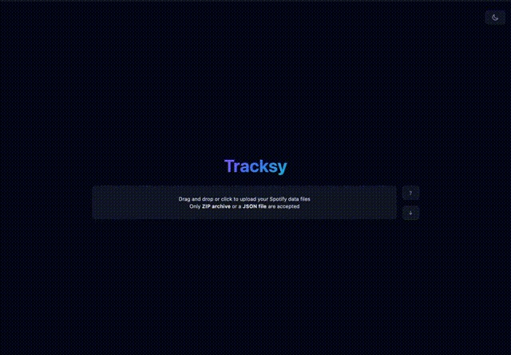

# Tracksy

[](https://github.com/withastro/astro) [](https://github.com/duckdb/duckdb) [](https://huggingface.co/datasets/tracksy/synthetic-datasets) [](https://github.com/astral-sh/uv) [](https://github.com/astral-sh/ruff) [](https://github.com/astral-sh/ty)

[](./LICENSE) [](https://github.com/gudsfile/tracksy/actions/workflows/app-deploy-live.yml) [](https://github.com/gudsfile/tracksy/actions/workflows/datasets-generate-synthetic.yml)

👀 Visualize and understand how you listen to music.

- > The same old song? Late at night? Only in summer?
- Tracksy aims to help you answer these questions. It helps you see your data without us seeing your data.

🦆 Powered by DuckDB WASM x Astro x React.

🚧 Currently only works with Spotify streaming data.

## Project Structure

Inside of this project, you'll see the following folders and files:

```text
/
├── app/
└── synthetic-datasets/
```

`app/` is the front end. It's an Astro project using DuckDB for data storage. This means that your uploaded data stays with you, client-side.
We don't want to help you understand your data without knowing your data.
For developers or curious, take a look at [`app/README.md`](app/#tracksy-app) for more details on development.

`synthetic-datasets/` is use to generate datasets to test the Tracksy application.
For developers or curious, take a look at [`synthetic-datasets/README.md`](synthetic-datasets/) for more details on development.

## Usage

### ⬇️ Download your data

You can skip this step using pre-generated datasets through the demo button on the home page.

**Or use your own Spotify data:**

1. Request your Spotify data on [your Spotify account](https://www.spotify.com/account/privacy/)
   - Select "_Extended streaming history_"
   - Click on "_Request data_"
   - **Confirm your request** by clicking on Spotify's confirmation e-mail
2. 30 days or less later
3. Open the mail from Spotify and download files

### 🚀 Upload your data

Go to [Tracksy](https://gudsfile.github.io/tracksy/) and upload your file or use the demo button.

No data is sent to us, it stays with you!

You can also deploy Tracksy on your own, just take a look at the [documentation](app/).

### 👀 Visualize your data

Once you've uploaded your file, you'll be able to see graphs about your data. 🎉



## _"Roadmap"_

The project is currently under development. We plan to add visualizations as well as a simplified view to make understanding streaming data as accessible as possible.
We also intend to support other data sources (Deezer, Funkwhale, etc.).
See our [issues](https://github.com/Gudsfile/tracksy/issues).

## Installation

 ```bash
 moon setup

 moon run app:dev
 moon run synthetic-datasets:generate -- 100
 moon run blog:dev
 moon run e2e:test
 ```

 More details in [CONTRIBUTING.md development section](CONTRIBUTING.md#development)

## Contributing

Contributions are welcome! Feel free to open an issue or a pull request (don't forget to consult our [CONTRIBUTING.md](CONTRIBUTING.md)).

If you would like to be added to or removed from this list, feel free to open an issue or a PR.

<!-- ALL-CONTRIBUTORS-LIST:START - Do not remove or modify this section -->
<!-- prettier-ignore-start -->
<!-- markdownlint-disable -->
<table>
  <tbody>
    <tr>
      <td align="center" valign="top" width="14.28%"><a href="https://github.com/Tarektouati"><br /><sub><b>Tarek Touati</b></sub></a></td>
      <td align="center" valign="top" width="14.28%"><a href="https://github.com/bengeois"><br /><sub><b>Benjamin</b></sub></a></td>
      <td align="center" valign="top" width="14.28%"><a href="https://github.com/noancloarec"><br /><sub><b>noancloarec</b></sub></a></td>
      <td align="center" valign="top" width="14.28%"><a href="https://jeanphi-baconnais.gitlab.io/"><br /><sub><b>Jean-Phi Baconnais</b></sub></a></td>
    </tr>
  </tbody>
</table>

<!-- markdownlint-restore -->
<!-- prettier-ignore-end -->

<!-- ALL-CONTRIBUTORS-LIST:END -->
