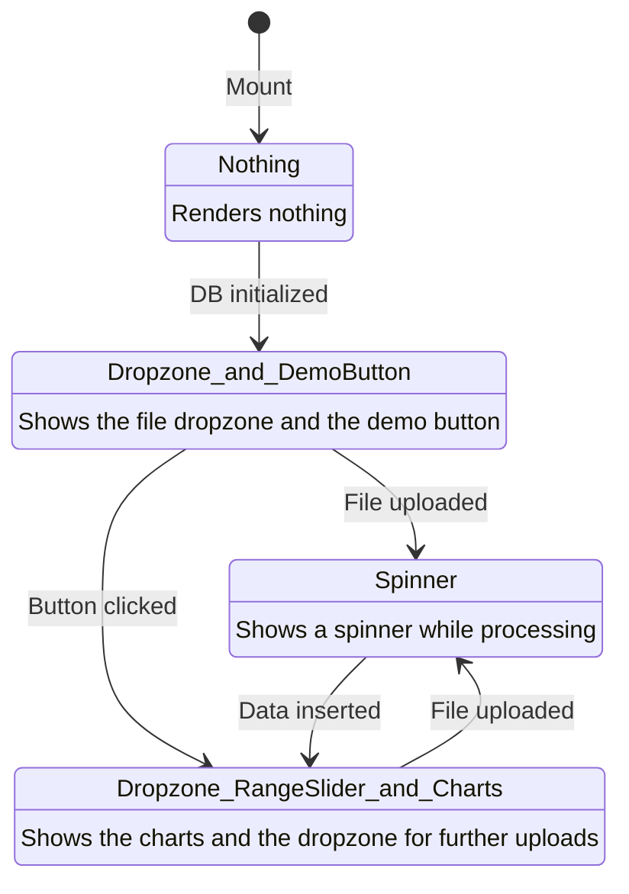
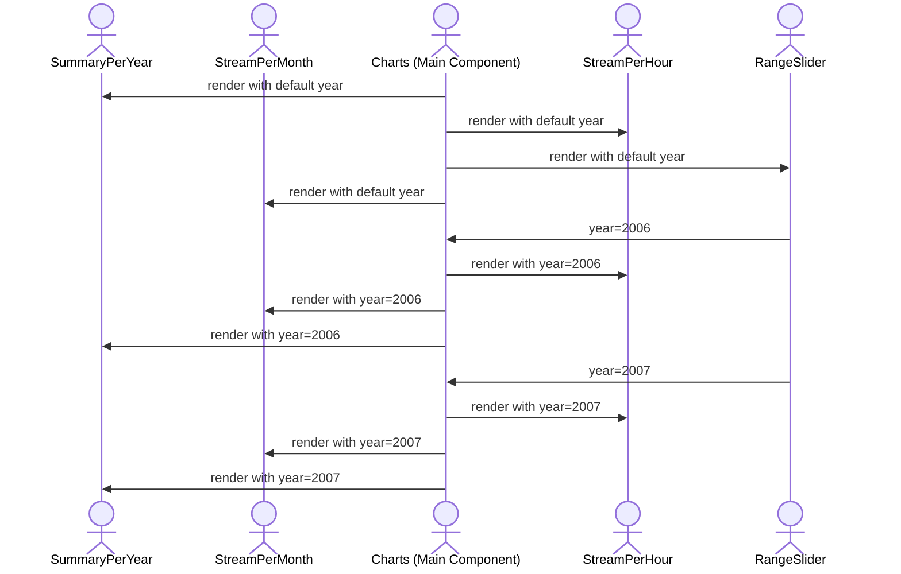

# Tracksy app

Front end of Tracksy based on [Astro](https://docs.astro.build/en/getting-started/) and use [DuckDB](https://duckdb.org/docs/) as embedded database.

## ⏩ Quick Start

Run the application locally with:

```bash
moon setup
moon run app:dev
```

Go to [`http://localhost:4321/`](http://localhost:4321/) and upload your downloaded file.

More details in [CONTRIBUTING.md development section](CONTRIBUTING.md#development)

### 🎵 Spotify API Configuration

To enable Spotify integration features locally, you'll need to configure your Spotify Client ID:

1. **Create a Spotify Developer App**
    - Go to [https://developer.spotify.com/dashboard](https://developer.spotify.com/dashboard) and log in with your Spotify account
    - Click **"Create an App"**
    - Fill in the app name (e.g., "Tracksy Local Dev") and description
    - Click **"CREATE"**

2. **Configure Redirect URI**
    - On your app overview page, click **"Edit Settings"**
    - Add `http://localhost:4321/` to **Redirect URIs**
    - Click **"SAVE"**

3. **Get Your Client ID**
    - Copy the **Client ID** displayed on your app overview page

4. **Configure Environment**
    - Copy `.env.example` to `.env` in the `app/` directory
    - Update `PUBLIC_SPOTIFY_CLIENT_ID` with your Client ID:
        ```bash
        PUBLIC_SPOTIFY_CLIENT_ID=your_actual_client_id_here
        ```

> [!NOTE]  
> You do NOT need the Client Secret. Tracksy uses the PKCE flow which only requires the Client ID.

## 🚀 Project Structure

As an Astro project, you'll see the following folders and files:

```text
/
├── public/
│   └── # public assets such as favicons, images, etc.
├── src/
│   ├── components/
│   │   └── # reusable UI elements written in Astro/React/Vue/Svelte/Preact
│   │         # see below for details of specific Tracksy components
│   ├── layouts/
│   │   └── # common structure such as header and footer for multiple pages
│   └── pages/
│       └── # route-based files that generate the actual web pages
│             # Tracksy currently has only one page
└── package.json
```

Astro looks for `.astro` or `.md` files in the `src/pages/` directory. Each page is exposed as a route based on its file name.

There's nothing special about `src/components/`, but that's where we like to put any Astro/React/Vue/Svelte/Preact components. See [below](##Components) for details of specific Tracksy components.

Any static assets, like images, can be placed in the `public/` directory.

## 🔧 Components

### 🗂️ TracksyWrapper Component

The `TracksyWrapper` component is the main orchestrator for Tracksy's UI state transitions. It manages the initialization of the database, file uploads, demo data loading, and the conditional rendering of child components based on the application's state. Below is a mermaid diagram illustrating the state transitions and what is rendered in each state:



### 📊 Charts Component

The `Charts` component is responsible for orchestrating and rendering visualizations in the app. It manages how different components interact with each other, such as coordinating between the `RangeSlider` and `StreamPerHour` components. Below is a mermaid diagram that illustrates how the `Charts` works (without the summarize query):



This flow shows how user interaction leads to the rendering of dynamic charts based on fetched data.
