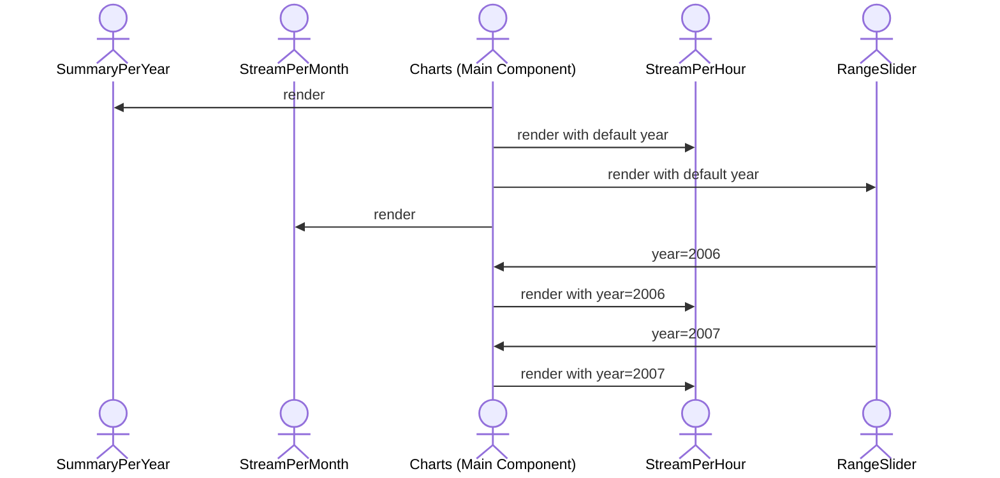

# Tracksy app

Front end of Tracksy based on [Astro](https://docs.astro.build/en/getting-started/) and use [DuckDB](https://duckdb.org/docs/) as embedded database.

Run the application locally with:

```shell
cd app
pnpm install
pnpm dev
```

Go to [`http://localhost:4321/`](http://localhost:4321/) and upload your downloaded file.

## 🚀 Project Structure

As an Astro project, you'll see the following folders and files:

```text
/
├── public/
│   └── # public assets such as favicons, images, etc.
├── src/
│   ├── components/
│   │   └── # reusable UI elements written in Astro/React/Vue/Svelte/Preact
│   │         # see below for details of specific Tracksy components
│   ├── layouts/
│   │   └── # common structure such as header and footer for multiple pages
│   └── pages/
│       └── # route-based files that generate the actual web pages
│             # Tracksy currently has only one page
└── package.json
```

Astro looks for `.astro` or `.md` files in the `src/pages/` directory. Each page is exposed as a route based on its file name.

There's nothing special about `src/components/`, but that's where we like to put any Astro/React/Vue/Svelte/Preact components. See [below](##Components) for details of specific Tracksy components.

Any static assets, like images, can be placed in the `public/` directory.

## 🧞 Commands

All commands are run from `tracksy/app/`, from a terminal:

| Command            | Action                                                          |
| :----------------- | :-------------------------------------------------------------- |
| **`pnpm install`** | Installs the project dependencies using [pnpm](https://pnpm.io) |
| ------------       | --------------------------------------------                    |
| **`pnpm dev`**     | Starts local dev server at `localhost:4321`                     |
| ------------       | --------------------------------------------                    |
| **`pnpm format`**  | Reformat files                                                  |
| **`pnpm test`**    | Run tests                                                       |
| **`pnpm build`**   | Build your production site to `./dist/`                         |

## 🔧 Components

### 📊 Charts Component

The `Charts` component is responsible for orchestrating and rendering visualizations in the app. It manages how different components interact with each other, such as coordinating between the `RangeSlider` and `StreamPerHour` components. Below is a mermaid diagram that illustrates how the `Charts` works (without the summarize query):



This flow shows how user interaction leads to the rendering of dynamic charts based on fetched data.
