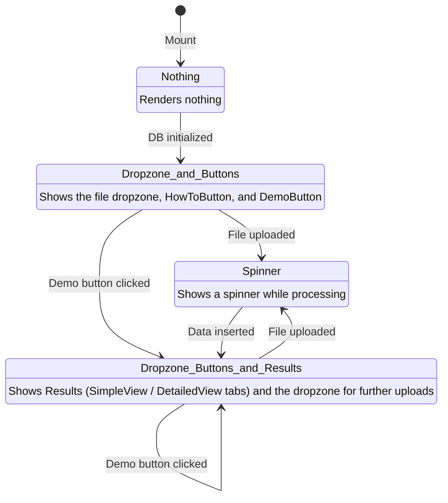
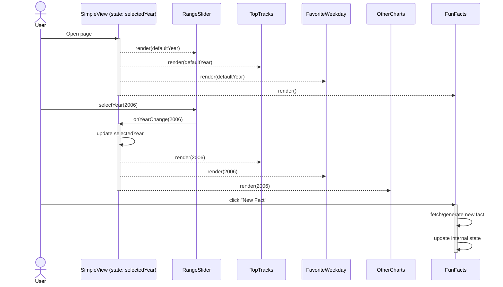

# Tracksy app

Front end of Tracksy based on [Astro](https://docs.astro.build/en/getting-started/) and use [DuckDB](https://duckdb.org/docs/) as embedded database.

## ⏩ Quick Start

Run the application locally with:

```bash
moon setup
moon run app:dev
```

Go to [`http://localhost:4321/`](http://localhost:4321/) and upload your downloaded file.

More details in [CONTRIBUTING.md development section](../CONTRIBUTING.md#development)

### 🎮 Demo Mode (Recommended)

To enable the demo button and explore Tracksy without your own data:

1. Copy `.env.example` to `.env` (`cp app/.env.example app/.env`)
2. The `PUBLIC_DEMO_JSON_URL` is already configured in `.env.example`

## 🚀 Project Structure

As an Astro project, you'll see the following folders and files:

```text
/
├── public/
│   └── # public assets such as favicons, images, etc.
├── src/
│   ├── components/
│   │   └── # reusable UI elements written in Astro/React/Vue/Svelte/Preact
│   │         # see below for details of specific Tracksy components
│   ├── db/
│   │   └── # DuckDB setup, initialization, and query logic
│   ├── layouts/
│   │   └── # common structure such as header and footer for multiple pages
│   └── pages/
│       └── # route-based files that generate the actual web pages
│             # Tracksy currently has only one page
└── package.json
```

Astro looks for `.astro` or `.md` files in the `src/pages/` directory. Each page is exposed as a route based on its file name.

There's nothing special about `src/components/`, but that's where we like to put any Astro/React/Vue/Svelte/Preact components. See [below](##Components) for details of specific Tracksy components.

Any static assets, like images, can be placed in the `public/` directory.

## 🔧 Components

### 🗂️ TracksyWrapper Component

The `TracksyWrapper` component is the main orchestrator for Tracksy's UI state transitions. It manages the initialization of the database, file uploads, demo data loading, and the conditional rendering of child components based on the application's state. Below is a mermaid diagram illustrating the state transitions and what is rendered in each state:


```mermaid
stateDiagram-v2
  [*] --> Nothing:Mount
  Nothing --> Dropzone_and_Buttons:DB initialized
  Dropzone_and_Buttons --> Spinner:File uploaded
  Dropzone_and_Buttons --> Dropzone_Buttons_and_Results:Demo button clicked
  Spinner --> Dropzone_Buttons_and_Results:Data inserted
  Dropzone_Buttons_and_Results --> Spinner:File uploaded
  Dropzone_Buttons_and_Results --> Dropzone_Buttons_and_Results:Demo button clicked

  Nothing:Nothing
  Dropzone_and_Buttons:Dropzone_and_Buttons
  Spinner:Spinner
  Dropzone_Buttons_and_Results:Dropzone_Buttons_and_Results

Nothing:Renders nothing
Dropzone_and_Buttons:Shows the file dropzone, HowToButton, and DemoButton
Spinner:Shows a spinner while processing
Dropzone_Buttons_and_Results:Shows Results (SimpleView / DetailedView tabs) and the dropzone for further uploads
```

> [!NOTE]
> `ThemeToggle` is rendered as a persistent overlay in `App.tsx` (wraps `TracksyWrapper` with a `ThemeProvider`).

### 📊 Results Component

The `Results` component renders visualizations in two tabs:

Both views use a `RangeSlider` to filter by year. User interaction (year change) re-renders only the charts within the active view.

- **SimpleView** — a grid of high-level insights (top tracks/artists/albums, listening patterns, fun facts, etc.)
- **DetailedView** — deeper exploration with time-series charts (`StreamPerMonth`, `StreamPerHour`, `SummaryPerYear`) and an interactive `DuckDBShell`

Each view is responsible for orchestrating and rendering visualizations. It manages how different components interact with each other, such as coordinating between the RangeSlider and insights components. Below is a mermaid diagram that illustrates how the SimpleView works (without the summarize query):


```mermaid
sequenceDiagram
  actor User
  participant SimpleView as SimpleView (state: selectedYear)
  participant RangeSlider
  participant TopTracks
  participant FavoriteWeekday
  participant OtherCharts
  participant FunFacts

  %% Initial page load
  User ->> SimpleView: Open page
  activate SimpleView
  SimpleView -->> RangeSlider: render(defaultYear)
  SimpleView -->> TopTracks: render(defaultYear)
  SimpleView -->> FavoriteWeekday: render(defaultYear)
  SimpleView -->> FunFacts: render()
  deactivate SimpleView

  %% User changes year
  User ->> RangeSlider: selectYear(2006)
  RangeSlider ->> SimpleView: onYearChange(2006)
  activate SimpleView
  SimpleView ->> SimpleView: update selectedYear
  SimpleView -->> TopTracks: render(2006)
  SimpleView -->> FavoriteWeekday: render(2006)
  SimpleView -->> OtherCharts: render(2006)
  deactivate SimpleView

  %% FunFacts internal update
  User ->> FunFacts: click "New Fact"
  activate FunFacts
  FunFacts ->> FunFacts: fetch/generate new fact
  FunFacts ->> FunFacts: update internal state
  deactivate FunFacts
```

### 🗃️ SimpleCharts Component Convention

Each chart in `SimpleView` lives in `src/components/Charts/SimpleCharts/<ComponentName>/` and follows a consistent file layout:

```text
TopArtists/
├── index.tsx              # Data-fetching container (useDBQueryMany / useDBQueryFirst → passes data down)
├── TopArtists.tsx         # Presentation component (pure render, no DB logic)
├── query.ts               # DuckDB query function + result TypeScript type
├── classifyTopArtists.ts  # (optional) pure classification/scoring helper
└── *.test.ts(x)           # Unit tests for each file above
```

The separation between `index.tsx` (data) and `<Component>.tsx` (display) makes each chart independently testable without a database.

### 🧩 Shared UI Primitives

Reusable display components are in `src/components/Charts/SimpleCharts/shared/` and exported via its `index.ts`:

| Component            | Purpose                                                |
| -------------------- | ------------------------------------------------------ |
| `ChartCard`          | Wrapper card with title, emoji                         |
| `ChartHero`          | Prominent metric display with label and optional emoji |
| `RankedList`         | Ranked list with medal emojis                          |
| `ProgressBar`        | Simple percentage bar                                  |
| `LabeledProgressBar` | Progress bar with label and value                      |
| `InsightCard`        | Highlighted text block for insights                    |
